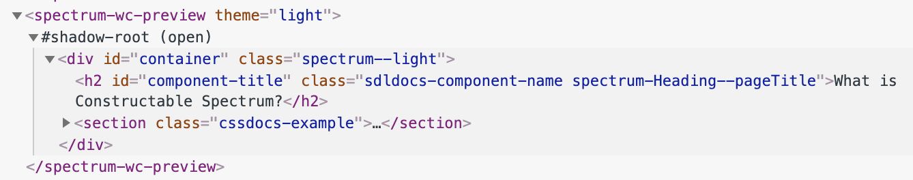
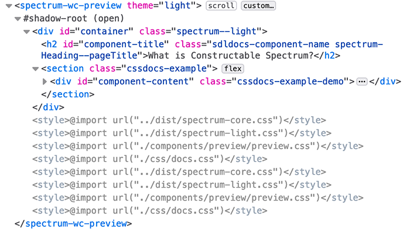

# Style Shelter
##### An adoption shelter for your style sheets


Great for 
+ Design Systems
+ The Shadow DOM
+ Web Components
+ CSS Modules (probably... once they are supported in the browser) 

Uses
+ Constructable Stylesheets (Chrome only, but can be polyfilled)
+ ES6 Module feature
+ ES6 WeakMaps

When using the Shadow DOM (commonly in Web Components), outside style cannot pierce
the Shadow Boundary and make its way in. Awesome, right? Not so if you need to use a design
system or similar.

Now, Web Component users can adopt a stylesheet that can live happily inside the safe comfort
of their very own Shadow DOM. The stylesheet is also not a clone of the original - it is a reference, which
means that entire design systems aren't recreated in every component instance.

#### Main usage:

StyleShelter.adopt accepts an array of URLs, as well as a default scope.
Internally, your URLs will be turned into proper StyleSheet objects using 

```javascript
    new CSSStyleSheet();
```

Once constructed, your URL will be loaded internally via the CSS @import directive

```javascript
sheet.replace(`@import url("${url}")`)
````

As StyleShelter is a globally used module, it will cache loaded stylesheets using
a WeakMap. Subsequent calls to load the same CSS file will return the cached sheet object.

```javascript
import StyleShelter from './style-shelter.js';
const styles = ['./css/docs.css', './components/app/app.css'];
StyleShelter.adopt(styles, this.shadowRoot);
```

### Mixed Adoption Scopes
Especially in the case of stylesheets containing CSS Vars or even broad container styles that 
break through the Shadow DOM because they are so generic, it may be desired to not adopt every style
to the same scope (like the shadowRoot). This is why the first parameter of the adopt method accepts
an array of Objects as well as string URLs.

An Object as part of this array can have keys of "url", and "scope". The following will adopt
styles to the desired scopes for each CSS URL. StyleShelter users may mix URL strings and objects 
in this array.

 
```javascript
import StyleShelter from './style-shelter.js';
const styles = [
    './css/docs.css', 
    './components/app/app.css', 
    { url: './css/vars.css', scope: document }];
StyleShelter.adopt(styles, this.shadowRoot);
```

### Configuration
The **adopt** method takes and optional third parameter, which is a configuration object. The default
is in the module and is the following:

```javascript
{
    append: [document],
    onSuccess: null,
    onError: function (err, message) {
        console.warn(err, err.message);
    }
}
```

The **append** key is an array containing scopes. Style Shelter, by default, replaces
the current array of Stylesheets with the one you specify using the new "adoptedStyleSheets" method.

```javascript
scope.adoptedStyleSheets = [someStyleSheets];
```

However, especially in the case of the page document object, you likely don't want to
replace the entire stylesheet array from an individual component, since it does affect the entire page.

This is why the **append** array contains the **document** object by default. Instead of replacing, stylesheets on the **document**
scope, it will add on, instead:

```javascript
scope.adoptedStyleSheets = scope.adoptedStyleSheets.concat([someStyleSheets]);
```

The **onSuccess** key is a success callback when the stylesheet has been successfully loaded.
With Constructable Style Sheets, CSS can be loaded synchronously, however, Style Shelter loads them
asynchronously because it uses the @import CSS directive. Though the newly constructed sheet comes back synchronously,
the CSS takes time to load. This callback allows a user to take action on load. One todo for Style Shelter could be to 
wait until load until the style sheet is adopted, however right now there is no option to do so.

The **onError** key is what you'd expect. If your stylesheet fails to load, it will produce an error. Also, if you fail
to specify scope (either as default or in an object), **onError** will fire. By default, *onError** will console.warn with your error.

### Polyfilling
Currently, Chrome is the only browser to support Constructable Stylesheets, the underlying feature behind Style Shelter. However, there is
a polyfill that simulates the desired results.

https://www.npmjs.com/package/construct-style-sheets-polyfill

Unfortunately Constructable Stylesheets cannot be completely replicated with a polyfill.
Shown below is a screen capture of a Shadow DOM enabled Web Component in Chrome that uses Style Shelter to adopt a number of CSS files.
 


Notice that there are no stylesheets visible here - they are all adopted as intended.

This next screen capture is from Firefox, where Constructed Stylesheets aren't supported, and the polyfill is being used.



Notice that these CSS are created inside the Shadow DOM, and imagine a large number
of component instances where we are constantly replicating the same stylesheets over and over again
for a design system. Obviously, not polyfilling will be better - so hopefully Firefox and Safari support Constructable Stylesheets soon.

### Using CSS Modules in the Future

Constructable Stylesheets solve a big problem and allow Web Component developers to adopt CSS from a design system or a common folder. They also unburden
the HTML page from having to know what CSS files are required throughout the application. Instead, each Web Component can be responsible for
loading exactly the CSS it needs.

An issue that isn't exactly solved yet is CSS specific to a Web Component. A common practice is to use strings (likely template literals) to store
CSS in a JS file.

```javascript
    css() {
        return `<style>
                    aRule {
                        display: flex;
                        position: relative;
                        align-items: center;
                        border-radius: 5px;
                        background-color: #ffffff;
                    }
                    ...
```

An obvious thought is to use Constructable Stylesheets to take the CSS here and
put it in an actual CSS file. Ideally, a developer would place it inside their component folder.
The problem however, is that CSS URLs are relative to your index.html page, so loading the CSS from inside your componenent would look like the following:

```javascript
StyleShelter.adopt(['./components/navigation/navigation.css'], this.shadowRoot);
```

The above assumes the component knows your entire application structure, where "navigations" is the name of the component. Web Components should be more self-reliant than this.
They should not be dependent on a defined application structure to function. A developer should just pop them in wherever they need 
to be and just work.

Though CSS Modules aren't available in any browsers yet, they may solve this problem (assuming they function like JS modules do).

```javascript
import Navigation from './navigation.css';
StyleShelter.adopt([Navigation], this.shadowRoot);
```

In fact - if CSS Modules work like JS modules do, where browser network requests aren't made for the same module imported from multiple places,
it might negate the need for most of what Style Shelter does with caching the style sheets.

